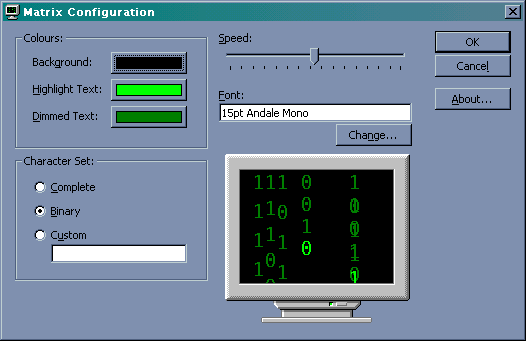



## Complete Matrix Screen Saver

### Description

A complete screen saver based on the film "The Matrix"

This code is based on the original submission by Stuart Pennington, however adds more functionality. It is now a complete screen saver, with customisation options, and real previews in the config dialog and Display Properties. It also has a couple of minor bug fixes.

The code also has some API routines for selecting colours and fonts.

Well worth a look if you liked the original submission.
 
### More Info
 

             |
---                |---
**Submitted On**   |2000-07-07 08:19:24
**By**             |[Richard Moss](https://github.com/Planet-Source-Code/PSCIndex/blob/master/ByAuthor/richard-moss.md)
**Level**          |Advanced
**User Rating**    |4.1 (45 globes from 11 users)
**Compatibility**  |VB 5\.0, VB 6\.0
**Category**       |[Complete Applications](https://github.com/Planet-Source-Code/PSCIndex/blob/master/ByCategory/complete-applications__1-27.md)
**World**          |[Visual Basic](https://github.com/Planet-Source-Code/PSCIndex/blob/master/ByWorld/visual-basic.md)
**Archive File**   |[CODE\_UPLOAD7501772000\.zip](https://github.com/Planet-Source-Code/richard-moss-complete-matrix-screen-saver__1-9569/archive/master.zip)

